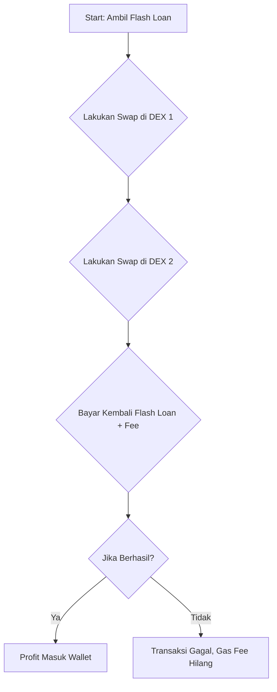
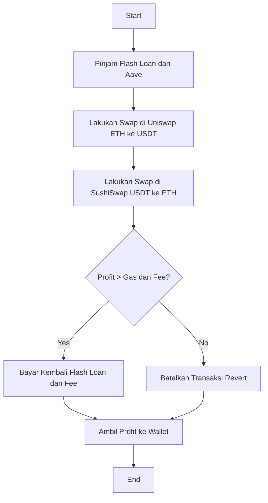

<p align="center">
  
  &nbsp;&nbsp;
  
  &nbsp;&nbsp;
  
  &nbsp;&nbsp;
  
  &nbsp;&nbsp;
  
  &nbsp;&nbsp;
  
  &nbsp;&nbsp;
  
  &nbsp;&nbsp;
  
  &nbsp;&nbsp;
  
  &nbsp;&nbsp;
  
</p>


<h1 align="center">⚡ Flash Loan Arbitrage Bot & Smart Contract</h1>

<p align="center">
  <strong>By <a href="https://github.com/kongali1720">kongali1720</a></strong>
</p>

<p align="center">
  <!-- GitHub Stats -->
  <a href="https://github.com/kongali1720/flash-loan-arbitrage/stargazers">
    
  </a>
  <a href="https://github.com/kongali1720/flash-loan-arbitrage/network">
    
  </a>
  <a href="https://github.com/kongali1720/flash-loan-arbitrage/issues">
    
  </a>
  
  
</p>

<p align="center">
  <!-- Deployment & Info -->
  
  &nbsp;
  <a href="https://sepolia.etherscan.io/address/0x0dB8113569a648c31F1eE6DfbAB2AC5Eb19389A7" target="_blank">
    
  </a>
  &nbsp;
  
</p>


<hr />

<h2 align="center">🚀 Let's Celebrate!</h2>

<p align="center">
  
</p>

<hr />


## 🚀 Intro

**Flash Loan Arbitrage Bot & Smart Contract** adalah solusi canggih untuk memanfaatkan peluang arbitrase di dunia DeFi tanpa modal awal.  
Dengan memanfaatkan flash loan dari protokol terpercaya seperti Aave, DODO, dan lainnya, kamu bisa melakukan swap cepat antar DEX dan mendapatkan profit instan—semua dalam satu transaksi atomic.  
Repo ini berisi smart contract siap deploy, bot scanner peluang arbitrase, dan UI web sederhana untuk memudahkan kamu eksekusi strategi ini.

---

## 🚀 Alur Kerja Flash Loan Arbitrage



### 📦 Sumber Flash Loan (Protokol Terpercaya)
| Protokol          | Jaringan                                               | Keterangan                              |
| ----------------- | ------------------------------------------------------ | --------------------------------------- |
| **Aave V2/V3**    | Ethereum, Polygon, Arbitrum, Avalanche, Optimism, Base | Paling umum digunakan, dokumentasi kuat |
| **DODO**          | Ethereum, BNB, Arbitrum, Polygon                       | Flash loan via API langsung             |
| **Balancer**      | Ethereum, Arbitrum                                     | Multi-asset vault lending               |
| **Uniswap V3**    | Ethereum, Arbitrum                                     | Flash callback internal                 |
| **Cream Finance** | Ethereum, BNB                                          | Mirip Aave                              |
| **Fuse (Rari)**   | Ethereum                                               | Pool lending khusus                     |

### 🪙 Token yang Cocok Digunakan
| Token    | Tipe               | Cocok Untuk                  |
| -------- | ------------------ | ---------------------------- |
| **WETH** | Base Asset         | Dasar semua swap di Ethereum |
| **DAI**  | Stablecoin         | Arbitrase stablecoin         |
| **USDC** | Stablecoin         | Stable arbitrage             |
| **USDT** | Stablecoin         | Stable swap arbitrase        |
| **WBTC** | BTC Asset          | BTC–ETH arbitrase            |
| **LINK** | Oracle             | Token volatil                |
| **FRAX** | Algorithmic Stable | Curve/Frax arbitrase         |
| **LUSD** | Stablecoin         | Arbitrase Curve stables      |

### 🔁 Strategi Arbitrase Populer
| Strategi                   | Pair Contoh                |
| -------------------------- | -------------------------- |
| ETH → DAI → ETH            | WETH/DAI (Uniswap → Sushi) |
| Stablecoin swing arbitrase | USDC ↔ DAI                 |
| BTC/ETH arbitrase          | WBTC ↔ WETH                |
| Triangular arbitrase       | WETH → USDT → DAI → WETH   |
| Curve/Uniswap arbitrase    | FRAX, LUSD, USDT           |

### 🌐 Rekomendasi DEX untuk Arbitrase
| DEX               | Jaringan           | Catatan                   |
| ----------------- | ------------------ | ------------------------- |
| **Uniswap V3**    | Ethereum, Arbitrum | Swap fee 0.3%, pool besar |
| **SushiSwap**     | Ethereum, Polygon  | Alternatif Uniswap        |
| **Curve Finance** | Ethereum, Arbitrum | Fokus stablecoin pool     |
| **Balancer**      | Ethereum, Polygon  | Multi-asset, fleksibel    |
| **PancakeSwap**   | BNB Smart Chain    | Swap murah                |
| **1inch**         | Multi-chain        | Aggregator semua DEX      |
| **Trader Joe**    | Avalanche          | AVAX pool                 |
| **KyberSwap**     | Multi-chain        | Cek harga terbaik         |

---

### ⚙️ Cara Kerja Eksekusi Flash Loan

Ambil Flash Loan dari Aave/DODO

  Lakukan swap di DEX 1 (misal: Uniswap)

  Jual kembali di DEX 2 (misal: SushiSwap)

  Kembalikan pinjaman (plus fee) dalam transaksi yang sama

  Profit otomatis masuk wallet kamu

  Jika salah satu langkah gagal → transaksi dibatalkan → kamu tidak rugi aset (hanya gas)

---

### ⛽ Estimasi Biaya Gas (Mainnet)
| Aksi                   | Estimasi Gas | ETH Biaya (@ \$3,500) |
| ---------------------- | ------------ | --------------------- |
| Deploy kontrak         | ±300,000     | \~0.03–0.05 ETH       |
| Eksekusi arbitrase     | ±150–300k    | \~0.02–0.04 ETH       |
| Total modal awal (gas) |              | \~0.07–0.08 ETH       |

---

### 📉 Apa Itu Slippage?
Slippage adalah selisih harga antara saat kamu memulai swap dan saat swap benar-benar terjadi.
Solusi: gunakan DEX besar & pool likuid, toleransi slippage kecil, dan hindari transaksi besar di pool kecil.

---

### 🧠 Tips & Tools Tambahan
| Tools / Strategi       | Keterangan                      |
| ---------------------- | ------------------------------- |
| Flashbots / MEV Bundle | Cegah front-running arbitrase   |
| Ethers.js / Web3.py    | Trigger kontrak dari bot        |
| Chainlink Price Feeds  | Dapatkan harga akurat real-time |
| 1inch Aggregator API   | Cari rute swap terbaik          |
| Subgraph (The Graph)   | Query DEX pool & harga historis |

### 📦 Contoh Struktur Project

```
flash-loan-arbitrage/
├── contracts/
│   └── FlashLoanArb.sol        # Smart contract utama
├── scripts/
│   └── deploy.js               # Deploy ke testnet/mainnet
├── bot/
│   └── scanner.js              # Scan peluang arbitrase DEX
├── ui/
│   └── index.html              # Interface HTML/JS
├── README.md                   # Dokumentasi ini
```
### 🗓️ Time Table Belajar Flash Loan Arbitrage (4 Minggu Intensif)
| Minggu | Topik Utama                                  | Fokus Harian                                                                                  | Tools / Sumber Belajar                        |
| ------ | -------------------------------------------- | --------------------------------------------------------------------------------------------- | --------------------------------------------- |
| 1      | 🔧 Dasar-dasar DeFi & Flash Loan             | - Apa itu DeFi, DEX, flash loan<br> - Smart contract dasar<br> - Wallet & ETH testnet         | Ether.js, Remix, MetaMask, Sepolia Faucet     |
|        |                                              | - Coba kirim ETH testnet<br> - Deploy simple contract di Remix                                | [aave.com](https://aave.com), \[Remix IDE]    |
| 2      | ⚙️ Flash Loan dengan Aave / DODO             | - Struktur flashLoan AaveV3<br> - Fungsi executeOperation<br> - Deploy & tes flash loan       | Hardhat, Aave Docs, OpenZeppelin              |
|        |                                              | - Dapatkan test ETH/token<br> - Lakukan flash loan kecil + bayar balik                        | Infura, Alchemy, Aave testnet                 |
| 3      | 🔄 Arbitrase Antar DEX (Uniswap, Sushi, dll) | - Pelajari DEX & router contract<br> - Simulasi swap antar DEX<br> - Hitung slippage & profit | Uniswap Docs, SushiSwap Docs, ethers.js       |
|        |                                              | - Buat bot pemantau harga<br> - Tambah UI trigger flash loan                                  | Web3.js, Etherscan, Token List, DexTools      |
| 4      | 🤖 Otomatisasi + Bot + UI + Deploy           | - Buat antarmuka (HTML/JS)<br> - Integrasi dengan Metamask<br> - Otomatisasi via Node.js      | Next.js, Vue/React (opsional), Hardhat        |
|        |                                              | - Simulasi di testnet & profit check<br> - Tulis README, publish ke GitHub                    | GitHub, Netlify (UI hosting), IPFS (opsional) |

### ✅ Checklist Harian Singkat (Bisa Diulang)
| Hari   | Tugas Utama                                 |
| ------ | ------------------------------------------- |
| Senin  | Baca teori & tonton 2 video YouTube terkait |
| Selasa | Coba deploy contract di Remix/Hardhat       |
| Rabu   | Uji flash loan atau DEX di testnet          |
| Kamis  | Coding bot scanner / smart contract swap    |
| Jumat  | Test hasil + optimasi gas / logika profit   |
| Sabtu  | Integrasi UI frontend (HTML/Metamask)       |
| Minggu | Refleksi, dokumentasi, upload ke GitHub     |

### 🎯 Target Akhir Setelah 4 Minggu

  ✅ Paham dan bisa deploy smart contract Flash Loan

  ✅ Bisa deteksi peluang arbitrase antar DEX

  ✅ Bisa bangun bot & frontend trigger flash loan

  ✅ Punya repo GitHub profesional siap dipamerin

  ✅ Siap pindah ke mainnet / cari funding / bounties

---

## 💸 Penyedia Flash Loan (Flash Loan Providers)

| Nama Protocol | Keterangan                                 |
|---------------|---------------------------------------------|
| **Aave**      | Penyedia flash loan utama (trusted, cepat) |
| **DODO**      | Flash loan-style via PMM (Proactive Market Maker) |
| **DyDx**      | DEX margin trading (bisa untuk arbitrase perpetual) |
| **Uniswap v3 (via flash swaps)** | Tidak disebut “flash loan”, tapi bisa swap tanpa modal awal |
| **Balancer**  | Flash loan via custom vault pool |
| **Cream Finance** | Fork Aave/Compound, juga punya flash loan |
| **Fuse/Volt** | Alternatif dari Rari Capital |

---

## 🔄 Tempat Arbitrase (Decentralized Exchanges / DEX)

| DEX Name        | Catatan                                      |
|------------------|----------------------------------------------|
| **Uniswap**      | Likuiditas tinggi, paling sering digunakan  |
| **SushiSwap**    | Fork Uniswap, kadang punya slippage tinggi  |
| **Curve Finance**| Terbaik untuk stablecoin arbitrage          |
| **1inch**        | Aggregator, mencari rute swap termurah      |
| **Balancer**     | Khusus pool berbobot (terjadi slippage aneh)|
| **PancakeSwap**  | Jaringan BSC, cocok untuk arbitrase multi-chain |
| **KyberSwap**    | Aggregator + router, cocok buat scanning    |

---

## 🪙 Token Umum untuk Arbitrase

| Token       | Keterangan                                |
|-------------|--------------------------------------------|
| **ETH / WETH** | Biasanya jadi aset dasar pinjaman / swap |
| **USDC / USDT** | Stablecoin utama, banyak digunakan di pool |
| **DAI**       | Stablecoin terdesentralisasi              |
| **WBTC**      | Bitcoin versi ERC20                       |
| **AAVE**      | Native token dari Aave                    |
| **CRV**       | Native token Curve                        |
| **UNI / SUSHI** | Token governance DEX                    |
| **1INCH**     | Token aggregator                          |

---

## 🔁 Jaringan Blockchain yang Cocok

| Network         | Keterangan                                     |
|------------------|-----------------------------------------------|
| **Ethereum Mainnet** | Likuiditas tinggi, tapi gas fee besar     |
| **Sepolia / Goerli** | Testnet untuk simulasi

---


## Diagram Flowchart Flash Loan Arbitrage



## ✅ Gaspol coding squad Indonesia! 🚀💻

> Belajar sambil praktek langsung. Run it, understand it.  
> Mini project Python yang gak bikin ngantuk!

---

## ☕ Traktir Kopi & Nasi Padang

<p align="center">
  <strong>Dukung terus biar semangat bikin karya edukatif lainnya...</strong><br>
  💡 ☕ <a href="https://www.paypal.com/paypalme/bungtempong99" target="_blank">Buy Me a Coffee via PayPal</a>
</p>

---

## 📫 Let’s Connect Like Hackers

| Platform | Detail |
|:--------|:-------|
| GitHub  | [kongali1720](https://github.com/kongali1720) |
| Email   | [kongali1720@gmail.com](mailto:kongali1720@gmail.com) |
| Website | [Coming soon — stay curious...](https://kongali1720.github.io) |

---

## ❤️ INITIATING HUMANITY MODE... for Down Syndrome

| Target        | Anak-anak Pejuang Down Syndrome |
|---------------|-------------------------------|
| Status        | Butuh Dukungan                |
| Aksi          | Buka Hati + Klik Link = Senyum Baru |

> Mereka bukan berbeda. Mereka hadir untuk mengajarkan kita arti cinta sejati dan kesabaran.

<p align="center">
  <a href="https://mydonation4ds.github.io/" target="_blank">
    
  </a>
</p>

---

## 💳 Dukungan Pembayaran DONASI

<p align="center">
  
  &nbsp;&nbsp;
  
  &nbsp;&nbsp;
  
</p>

---

<p align="center">
  Kalau project ini bermanfaat, kasih ⭐ ya dan share ke temen-temenmu!<br>
  Follow <a href="https://twitter.com/kongali1720" target="_blank">@kongali1720</a> buat update seru lainnya 🔥
</p>

<p align="center">
  <a href="https://twitter.com/kongali1720" target="_blank">
    
  </a>
</p>


